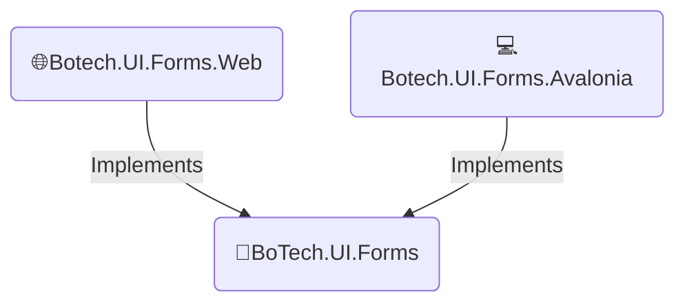
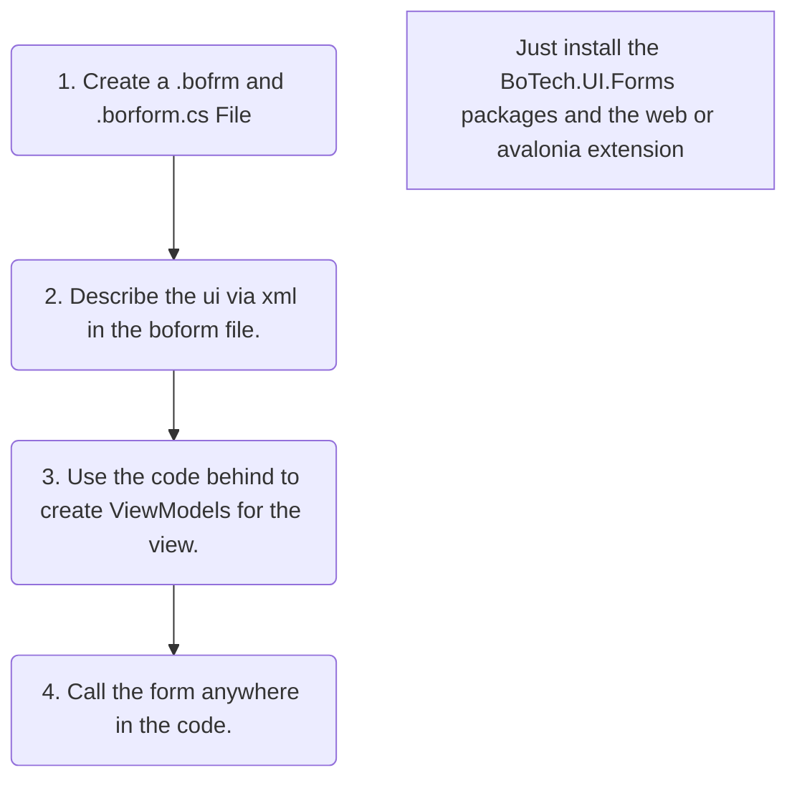



# 📝 BoTech.UI.Forms
### 📢📢📢 Complete new implementation to align the project with multiple platforms and better integrate it into other projects
#### 🪛⚙️ Please note: This Project is in EAP (Early Access Mode) or Beta mode => There may be serious errors in the software or functions may be only partially implemented. 

# What are the goals?
## Why BoTech.UI.Forms
+ My goal is to make it easier to create Forms for Applications such as a Login Form.
+ The Task to design such **forms** a`🕐time-consuming🕐`, `🥱repetitive🥱` and `🙄annoying🙄` when the css code does not work as intended.
### The solution:
+ I want to build a helper which not only translates the easy understandable View-Code into something ✨beautiful, but the project also should take care of the validation of a form.
+ Validating a form means, translating the inputs into ViewModels and checking if the values are correct. 
+ At the end of the development phase, it should be possible with the project to translate data provided by the user into an `🌐API request🌐`.

## 📌 The new basic Structure:

```mermaid
flowchart TD
    Bot.UI.F(📝BoTech.UI.Forms)
    Bot.UI.F.A(💻Botech.UI.Forms.Avalonia)
    Bot.UI.F.W(🌐Botech.UI.Forms.Web)
    Bot.UI.F.W --> |Implements| Bot.UI.F
    Bot.UI.F.A --> |Implements| Bot.UI.F
```
`Take a deeper look?` [See the UML-Diagram](https://github.com/BoTech-Development/BoTech.UI.Forms/tree/redesign-v1.1/doc/Uml.drawio)

## 🪛 The design flow of a form:

```mermaid
flowchart TD
    CreateFile(1. Create a .bofrm and .borform.cs File)
    DoOnce[Just install the BoTech.UI.Forms packages and the web or avalonia extension]
    CreateAForm(2. Describe the ui via xml in the boform file.)
    CreateTheCodeBehind(3. Use the code behind to create ViewModels for the view.)
    CallTheForm(4. Call the form anywhere in the code.)
    CreateFile --> CreateAForm --> CreateTheCodeBehind --> CallTheForm
```

# ©️ License
The License is: [MIT](https://github.com/BoTech-Development/BoTech.UI.Forms/blob/redesign-v1.1/LICENSE)
