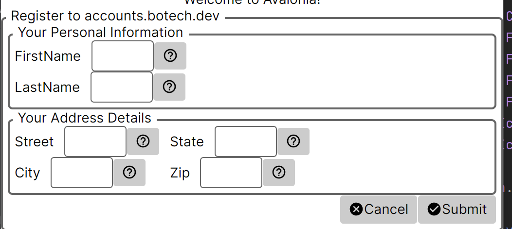

# BoTech.UI.Forms
## What is this?
+ This extension makes it easier to create input forms. All you need to do is create a ViewModel, add a few annotations, and tell my library to create a form for that ViewModel.

## Result

### ViewModel

more info will follow after the next commits...
Stay tuned!
